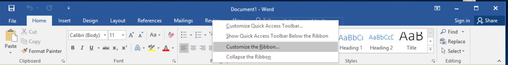

# Executing Macros From a DOCX With Remote Template Injection

Source: [July 18,2018 - http://blog.redxorblue.com/2018/07/executing-macros-from-docx-with-remote.html](http://blog.redxorblue.com/2018/07/executing-macros-from-docx-with-remote.html)

## The What:

In this post, I want to talk about and show off a code execution method
which was shown to me a little while back. This method allows one to
create a DOCX document which will load up and allow a user to execute
macros using a remote DOTM template file. This attack has been seen in
the wild, is partially included in [open-source offensive security tools](https://github.com/ryhanson/phishery/blob/master/badocx/badocx.go),
as has been blogged about by [Cisco Talos](https://blog.talosintelligence.com/2017/07/template-injection.html),
but in the blog post and the open-source tool, it is only seen as a
credential stealing attack typically over the SMB protocol. This blog
post will detail how to use this method to download a macro-enabled
template over HTTP(S) in a proxy-aware method into a DOCX document.

## The Why:

The benefit of this attack versus a traditional macro enabled document
is multidimensional. When executing a phishing attack against a target,
you able to attach the .docx directly to the email and you are very
unlikely to get blocked based on the file extension. Many organizations
block .doc or .docm but allow .docx because they are not supposed to be
able to contain macros.

Another reason this attack will likely land more often is because the
attachment itself does not contain malicious code. The macro itself is
not seen by any static email scanners so it is less likely to be
blocked. In the event that your target uses a sandbox to detonate email
attachments, you can use various sandbox evasion techniques such as
modrewrite rules or IP limiting to prevent the sandbox from being able
to pull down the malicious template.
[@bluescreenofjeff](https://twitter.com/bluscreenofjeff) has a wonderful
guide on creating modrewrite rules for this type of evasion in his [Red Team Infrastructure Wiki](https://github.com/bluscreenofjeff/Red-Team-Infrastructure-Wiki).  

## The How:

To start this attack, we need to create two different files. The first
will be the macro-enabled template, or .dotm file, which will contain a
malicious VBA macro. The second will be the seemingly benign .docx file
which contains no malicious code itself, only a target link which points
to your malicious template file.

## Getting Started:

In my blog posts and trainings that I provide to others, I aim to show
examples using free and open-source tools. I do this because I want
anyone reading this blog to be able to try it on their own (always
against their own systems or systems which they have permission to try
it on) and do not want to force people into purchasing commercial tools.
For this reason, I will walk through the steps for creating the remote
template document to execute a [PowerShell Empire](https://github.com/EmpireProject/Empire) payload. To keep to the
purpose of this post, I won’t detail out how to create the listener or
the macro for Empire here. There are many tutorials out there on how to
do this already. I will just walk through creating the documents to
execute the macro.

## Creating the Macro-Enabled Template:

For this attack to work, we need to create a macro-enabled Word template
(.dotm file extension) which contains our malicious Empire macro. Open
up Word and make the Developer tab on the ribbon visible:

Then open up the Visual Basic editor from the Developer tab and
double-click on ThisDocument under the current project to open up the
code window. Paste in your macro code into this window:

Give the template a name and save the file as a .dotm format. Please
note that the name is usually briefly visible to the user, so I
recommend something seemingly benign such as ‘InvoiceTemplate.dotm’:

Since I am just using the default macro from PowerShell Empire, it
quickly is picked up by Windows Defender, so I am going to disable it
for the demo. If your target uses Windows Defender, you will need to
pick a different tool or perform obfuscation until you can get a working
macro.

At this point, I tend to like to validate my template and macro by just
double-clicking on the document and making sure that I get the ‘Enable
Content’ button and that I get an agent when I click on it:

It works!

## Creating the Remote-Template-Loading Document:

With the template working, we now need to create a .docx file that will
download and load in the template from a remote resource. The easiest
way in which I have found to do this is to create a .docx document from
one of the provided Word templates, then just modify the target:

Modify the document as necessary to meet your phishing scenario in order
to get your target user to click the ‘Enable Content’ button if it shows
up for them. Save your document in the .docx format.

Next, find the document and right-click and rename the extension on the
document from .docx to .zip. Extract the contents of the zip file to a
folder and browse to that folder.

**Note**: With the release of Office 2007, Microsoft introduced the
formats that end in an ‘x’ character. Each of these formats are just zip
files containing mostly .xml and .rel files. You can manually edit the
document and its properties by changing these files then re-zipping the
contents.

Navigate to the ‘.\\word\\\_rels\\’ folder and open up the
‘settings.xml.rels’ file using a text editor such as Notepad:

The Relationship tag containing a Type with attachedTemplate will be the
setting that tells Word where to load in your template from when you
open that .docx. Currently, this is loading in a template from the local
file system:

The key is that this value will accept web URLs. We can modify the
Target value to be a remote location. In this case, I host my
macro-enabled template on GitHub:

Once we save this file, we can zip the contents back up and rename the
file back to a .docx. The next time that we open up our .docx, we can
see that the file is reaching out over HTTPS to our hosting service to
download the template:

And now our .docx file has a macro loaded in it and is allowed to run
macros:

There is a new pop-up to the user, but it does not affect the payload.
This is just due to the fact that .docx files are not intended to
contain macros. If the user clicks ‘Enable Content’ or has macros set to
run automatically, then we get our agents:

\

 Now prep your phishing email, send the .docx to the user, and wait for
the call backs!

## [No Shells Required - a Walkthrough on Using Impacket and Kerberos to Delegate Your Way to DA](http://blog.redxorblue.com/2019/12/no-shells-required-using-impacket-to.html)

- [December 20,2019](http://blog.redxorblue.com/2019/12/no-shells-required-using-impacket-to.html)

There are a ton of great resources that have been released in the past
few years on a multitude of Kerberos delegation abuse avenues.However,
most of the guidance out there is pretty in-depth and/or focuses on the
usage of @Harmj0y’s Rubeus.While Rubeus is a super well-written tool
that can do quite a few things extremely well, in engagements where I’m
already running off of a primarily Linux environment, having tools that
function on that platform can be beneficial.To that end, all the
functionality we need to perform unconstrained, constrained, and
resource-based constrained delegation attacks is already available to us
in the impacket suite of tools. \
 This post will cover how to identify potential delegation attack paths,
when you would want to use them, and give detailed walkthroughs of how
to perform them on a Linux platform.What we won’t be covering in this
guide is a detailed background of Kerberos authentication, or how
various types of delegation work in-depth, as there are so…

[Read more](http://blog.redxorblue.com/2019/12/no-shells-required-using-impacket-to.html "No Shells Required - a Walkthrough on Using Impacket and Kerberos to Delegate Your Way to DA")

## [Red Teaming Made Easy with Exchange Privilege Escalation and PowerPriv](http://blog.redxorblue.com/2019/01/red-teaming-made-easy-with-exchange.html)

- [January 31, 2019](http://blog.redxorblue.com/2019/01/red-teaming-made-easy-with-exchange.html "permanent link")

TL;DR: A new take on the recently released Exchange privilege escalation
attack allowing for remote usage without needing to drop files to disk,
local admin rights, or knowing any passwords at all.Any shell on a user
account with a mailbox = domain admin.  I wrote a PowerShell
implementation of PrivExchange that uses the credentials of the current
user to authenticate to exchange.  Find it
here: [https://github.com/G0ldenGunSec/PowerPriv](https://github.com/G0ldenGunSec/PowerPriv)

 The Exchange attack that @\_dirkjan released last week
([https://dirkjanm.io/abusing-exchange-one-api-call-away-from-domain-admin](https://dirkjanm.io/abusing-exchange-one-api-call-away-from-domain-admin))
provides an extremely quick path to full domain control on most
networks, especially those on which we already have a device that we can
run our tools on, such as during an internal network penetration
test.However, I saw a bit of a gap from the point of a more red-team
focused attack scenario, in which we often wouldn’t have a box on the
internal client network that we can run python scripts on (such as
ntlmrelayx and PrivE…

[Read more](http://blog.redxorblue.com/2019/01/red-teaming-made-easy-with-exchange.html "Red Teaming Made Easy with Exchange Privilege Escalation and PowerPriv")
